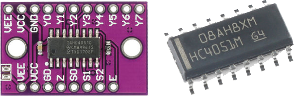
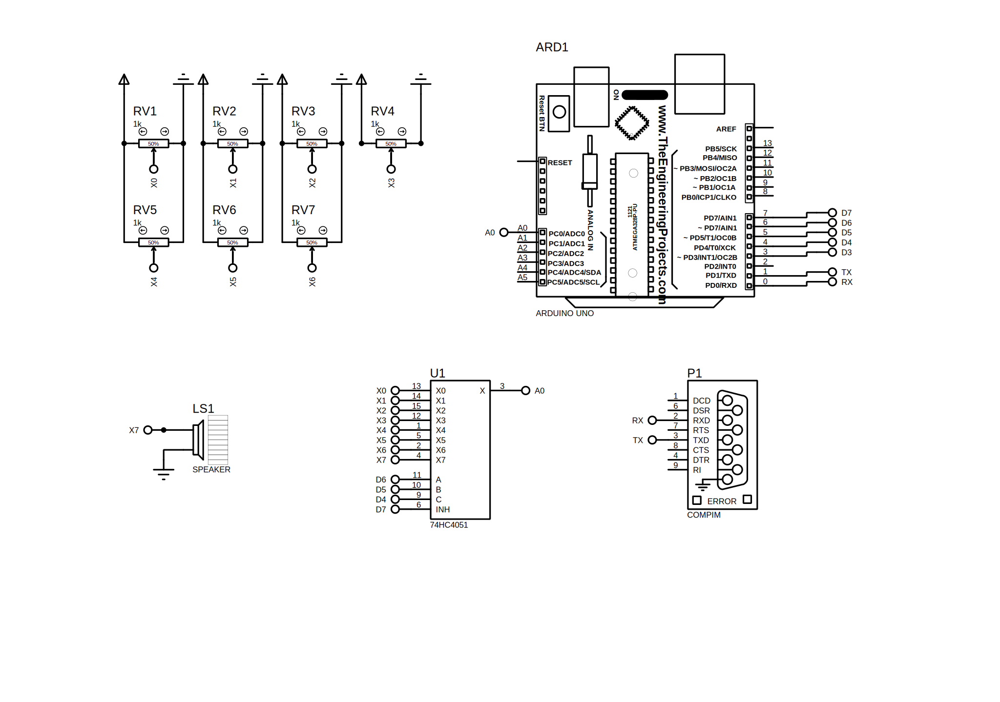

# Arduino 74HC4067

## 说明

一个Arduino的`Arduino74HC4051`的I/O拓展板库。 Arduino74HC4051 作用是选通一路对八路模拟信号。

测试兼容Arduino系列，包括：ESP32、ESP8266。



## 导入

#### PlatformIO

```ini
; Library options
lib_deps =
    https://github.com/arduine/Arduino74HC4051.git#main
```

#### ArduinoIDE

```c++
// TODO
```

## 使用

1. 增加头文件导入：

```c++
#include <Arduino74HC4051.h>
```

2. 编写代码

```c++
//
// 定义引脚
//
static Arduino74HC4051 sArduino74HC4051(A0, DD7, DD6, DD5, DD4);

void setup() {
    Serial.begin(9600);
    sArduino74HC4051.setup();
    sArduino74HC4051.setEnabled(true);
}

void loop() {
    auto X0 = sArduino74HC4051.analogRead(Arduino74HC4051::CHANNEL::X0);
    auto X1 = sArduino74HC4051.analogRead(Arduino74HC4051::CHANNEL::X1);
    auto X2 = sArduino74HC4051.analogRead(Arduino74HC4051::CHANNEL::X2);
    auto X3 = sArduino74HC4051.analogRead(Arduino74HC4051::CHANNEL::X3);
    auto X4 = sArduino74HC4051.analogRead(Arduino74HC4051::CHANNEL::X4);
    auto X5 = sArduino74HC4051.analogRead(Arduino74HC4051::CHANNEL::X5);
    auto X6 = sArduino74HC4051.analogRead(Arduino74HC4051::CHANNEL::X6);
    auto X7 = sArduino74HC4051.analogRead(Arduino74HC4051::CHANNEL::X7);
    Serial.println(String() +
        ", X0: " + X0 + ", X1: " + X1 + ", X2: " + X2 + ", X3: " + X3 +
        ", X4: " + X4 + ", X5: " + X5 + ", X6: " + X6 + ", X7: " + X7);
    delay(1000);
}
```

## 状态
| S0  | S1  | S2  | EN  | CHANNEL |
|:---:|:---:|:---:|:---:|:-------:|
| 🚫  | 🚫  | 🚫  | 🟥  |  None   |
| ⬜️  | ⬜️  | ⬜️  | ⬜️  |    0    |
| 🟥  | ⬜️  | ⬜️  | ⬜️  |    1    |
| ⬜️  | 🟥  | ⬜️  | ⬜️  |    2    |
| 🟥  | 🟥  | ⬜️  | ⬜️  |    3    |
| ⬜️  | ⬜️  | 🟥  | ⬜️  |    4    |
| 🟥  | ⬜️  | 🟥  | ⬜️  |    5    |
| ⬜️  | 🟥  | 🟥  | ⬜️  |    6    |
| 🟥  | 🟥  | 🟥  | ⬜️  |    7    |

> ##### 说明
> * 🚫=不关心(Don't Care)
> * ⬜️=低电平(Low)
> * 🟥=高电平(High)

## 电路



## LICENSE

```c++
/*
 * Copyright (C) 2022. sollyu
 *
 * Licensed under the Apache License, Version 2.0 (the "License");
 * you may not use this file except in compliance with the License.
 * You may obtain a copy of the License at
 *
 *         http://www.apache.org/licenses/LICENSE-2.0
 *
 * Unless required by applicable law or agreed to in writing, software
 * distributed under the License is distributed on an "AS IS" BASIS,
 * WITHOUT WARRANTIES OR CONDITIONS OF ANY KIND, either express or implied.
 * See the License for the specific language governing permissions and
 * limitations under the License.
 */
```